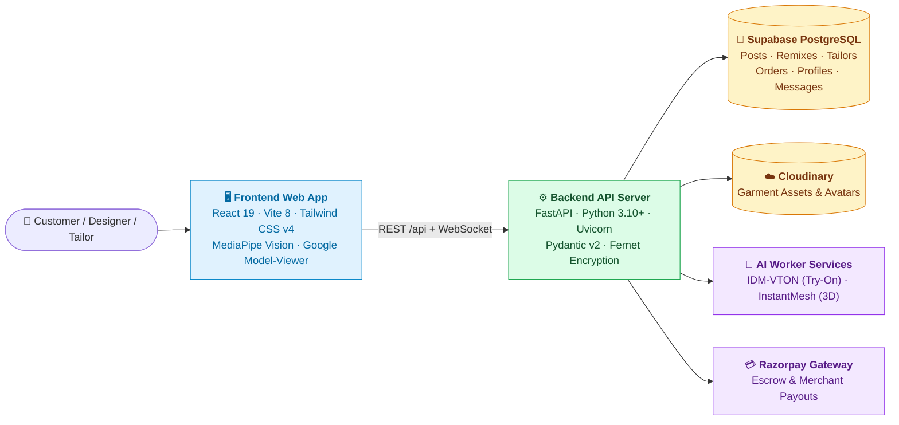
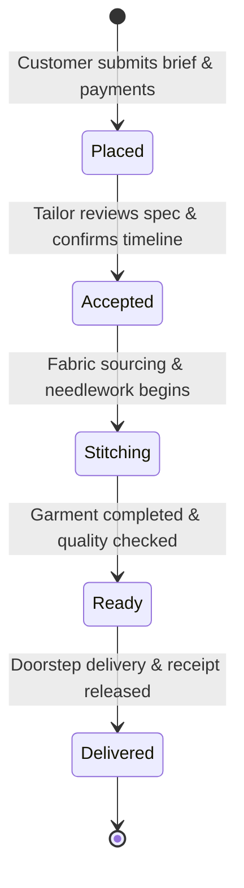
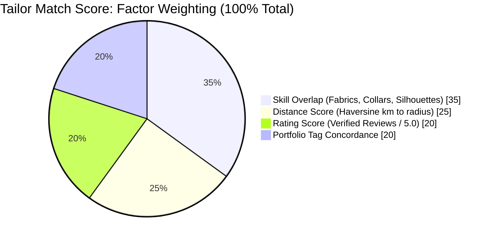
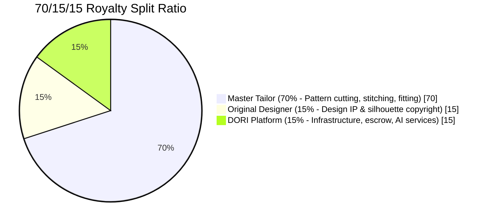

<div align="center">


# 🧵 DORI — See It. Remix It. Wear It.

**An explainable, closed-loop fashion discovery, garment customization, and tailor matchmaking platform.**  
Connecting designer garment discovery, structured tactile attribute remixing, browser-based digital body scanning, explainable 6-factor tailor matchmaking, and transparent 70/15/15 royalty economics into one seamless creation pipeline.

[](http://localhost:3000/app/)
[](http://localhost:8000/health)
[](http://localhost:8000/docs)

[](#-tech-stack)
[](#-tech-stack)
[](#-tech-stack)
[](#-tech-stack)
[](#-features)
[](#-tech-stack)
[](#-tech-stack)
[](#-license)

<sub>Independent bespoke fashion infrastructure · Built for seamless custom apparel creation and artisan empowerment.</sub>

<br>

> ### 🎯 *"Structured attributes, not a chat message. Fair royalties, not exploited artisans."*

</div>

---

### ⭐ Quick Pitch

> *"Why does bespoke fashion still rely on vague chat descriptions, uncertain tailor searches, and uncredited designer designs?"*  
> **DORI** solves the bespoke clothing disconnect end-to-end. Browse curated runway garments from top designers, remix physical attributes (neckline, sleeve cut, fabric, colorway, fit) with **tactile chip selectors** and a **zero-latency split visualizer**, scan body measurements directly from your webcam using **MediaPipe Pose Landmarking**, match with vetted local tailors via an **explainable 6-factor algorithmic score**, and track custom fabrication from cutting to doorstep delivery backed by a guaranteed **70% Tailor / 15% Designer / 15% Platform** royalty split.

<details>
<summary><b>📋 Hackathon MVP & Pitch Alignment Metadata (click to expand)</b></summary>
<br>

| Attribute | Specification |
|---|---|
| **Project Name** | DORI (*See it. Remix it. Wear it.*) |
| **Pillars Shipped** | Feed & Save · Tactile Remix Studio · Visualizer & Try-On · 6-Factor Tailor Match · Order Spec & Royalty Escrow |
| **Match Engine** | 6-factor weighted algorithm (Skill Overlap, Distance, Customer Rating, Portfolio Concordance) |
| **Measurement Engine** | Client-side MediaPipe Pose Vision (33 3D landmarks → shoulder, chest, waist, hip, sleeve, torso) |
| **Virtual Try-On & 3D** | IDM-VTON neural diffusion try-on & InstantMesh / Tripo 3D model generation |
| **Royalty Economics** | 70% Master Tailor / 15% Original Designer IP / 15% Platform Escrow & Operations |
| **Order Workflow** | 5-stage bidirectional state machine (`placed` → `accepted` → `stitching` → `ready` → `delivered`) |
| **Target Audience** | Fashion Enthusiasts, Independent Fashion Designers, Bespoke Local Tailors & Ateliers |

</details>

<p align="center">
  <a href="#-live-links">Live Demo</a> •
  <a href="#-tour-the-app-in-2-minutes">Tour</a> •
  <a href="#-problem--solution">Problem & Solution</a> •
  <a href="#-features">Features</a> •
  <a href="#-architecture">Architecture</a> •
  <a href="#-how-a-score-is-built">Scoring & Economics</a> •
  <a href="#-quickstart">Quickstart</a> •
  <a href="#-api-reference">API Docs</a>
</p>

---

## 🔗 Live Links

| Layer | URL | Notes |
|---|---|---|
| 🖥️ **Frontend** (React 19 + Vite) | **[http://localhost:3000/app/](http://localhost:3000/app/)** | Full glassmorphism web app, interactive remix studio, live tailor hub |
| ⚙️ **Backend API** (FastAPI) | **[http://localhost:8000/health](http://localhost:8000/health)** | High-performance async FastAPI service with Supabase Postgres |
| 📘 **Swagger Docs** | **[http://localhost:8000/docs](http://localhost:8000/docs)** | Interactive OpenAPI schema with live payload execution |

---

## 📸 Interactive Highlights

<details open>
<summary><b>🎨 Tactile Remix Studio & Interactive Split Visualizer</b></summary>
<br>

*Swap collar silhouettes, sleeve cuts, fabrics, and palettes in real-time. Slide the before/after divider to compare original designer vision against your custom remix without server rendering delays.*
</details>

<details open>
<summary><b>🧵 Explainable 6-Factor Tailor Matchmaking</b></summary>
<br>

*No black-box ranking: tailors are scored dynamically using Haversine distance, specific fabric/collar skill overlap, verified customer rating, and portfolio history.*
</details>

<details>
<summary><b>📐 MediaPipe Browser-Based Body Scanner</b></summary>
<br>

*Extract accurate shoulder width, chest circumference, waistline, and sleeve length directly via web camera pose estimation without sending private video feeds to third parties.*
</details>

<details>
<summary><b>💰 Transparent 70/15/15 Royalty Receipt & Order Stepper</b></summary>
<br>

*Automated escrow breakdown crediting the tailor for labor (70%), the designer for IP (15%), and DORI (15%), accompanied by a live 5-stage order tracker.*
</details>

---

## 🧭 Tour the App in 2 Minutes

| # | Step | What You Will Experience |
|:-:|---|---|
| **1** | Open **[Feed (`/feed`)](http://localhost:3000/app/)** | Browse designer drops (`@elena_couture`, `@mira_heritage`), bookmark outfits, follow designers, and tap **"Remix Design"**. |
| **2** | Enter **[Remix Studio (`/remix`)](http://localhost:3000/app/remix)** | Click tactile chips (Mandarin Collar, Bell Sleeves, Chanderi Silk, Onyx, Relaxed Fit). Drag the **split slider** to compare diffs. |
| **3** | Test **[Virtual Try-On (`/tryon`)](http://localhost:3000/app/tryon)** | Run AI virtual try-on via IDM-VTON neural diffusion or inspect photo-to-3D garment mesh models. |
| **4** | Click **"MAKE THIS" → [Match (`/match`)](http://localhost:3000/app/match)** | Inspect top 3 local tailors ranked by 6-factor score with breakdown bars (Skill, Distance, Rating, Portfolio) and instant quotes. |
| **5** | Launch **Measurement Scanner** | Click "Scan Measurements" to trigger webcam-based MediaPipe pose estimation for automated shoulder, chest, and sleeve sizing. |
| **6** | Submit **[Design Brief (`/brief`)](http://localhost:3000/app/brief)** | Review the generated tech pack with exact attribute diffs and body measurements; confirm via integrated Razorpay checkout. |
| **7** | View **[Royalty Receipt (`/receipt`)](http://localhost:3000/app/receipt)** | Inspect transparent royalty breakdown: **70% Tailor**, **15% Designer**, **15% Platform**. |
| **8** | Toggle **Tailor Mode (`/tailor-orders`)** | Switch role in header to open the Tailor Operator Hub and advance order state live (*Placed → Accepted → Stitching → Ready → Delivered*). |

---

## 🎯 Problem & Solution

**High fashion is visual and inspiring, but custom tailoring is fragmented, manual, and opaque.** Designers lack monetization when consumers recreate their work, tailors lack high-margin customer discovery, and consumers struggle with fit and communication.

<table>
<tr>
<td width="33%" valign="top">

### 😟 The Problem
- **Unstructured requests:** Customers send vague Pinterest screenshots and chat prompts that tailors cannot reliably construct.
- **Uncredited IP:** Designers get zero compensation when independent tailors clone their runway silhouettes.
- **Fit anxiety:** Manual tape measurements lead to errors, returns, and ill-fitting bespoke garments.
- **Opaque matching:** Finding skilled local tailors relies on random word-of-mouth with zero price or skill transparency.

</td>
<td width="33%" valign="top">

### 💡 Our Solution
- **Tactile attribute diffs:** Formulates structured design specifications (neckline, sleeve, fabric, fit) as code, not messy chats.
- **70/15/15 financial ledger:** Automatically allocates 15% designer royalty on every bespoke unit made.
- **MediaPipe AI scanning:** Real-time in-browser pose estimation calculates key measurements accurately.
- **Explainable 6-factor match:** Tailor matching algorithm pairs projects with the highest-affinity local craftsmen.

</td>
<td width="33%" valign="top">

### 🌟 What Makes It Different
- **Structured attributes, not free-text hallucinations:** Guarantees every customized variation is physically constructible.
- **Zero-latency visualizer:** Interactive split slider operates instantaneously on client hardware without wait times.
- **True artisan empowerment:** Gives master tailors an enterprise-grade digital order management hub.
- **Fair creator economics:** Direct IP attribution prevents design piracy while monetizing designer creativity.

</td>
</tr>
</table>

---

## ✨ Features

<table>
<tr>
<td width="33%" valign="top">

### 👗 Social Discovery & Feed
- Curated grid of designer silhouettes and garment collections
- Follow designer handles (`@elena_couture`, `@voss_atelier`)
- Recency and personalized follow-boosted feed ranking
- Bookmark / save counters and social share links

</td>
<td width="33%" valign="top">

### 🎛️ Tactile Remix Studio
- Structured attribute chips: Neckline, Sleeves, Fabric, Colorway, Fit
- Structured design diffs (*"attribute state, not chat messages"*)
- Client-side interactive split comparison slider
- Before vs. After side-by-side comparison mode

</td>
<td width="33%" valign="top">

### 🪞 AI Try-On & 3D Garment Mesh
- **IDM-VTON integration:** High-fidelity virtual try-on on customer photos
- **InstantMesh / Tripo 3D:** Turn garment photos into interactive 3D GLB meshes
- Async background job pooling with real-time status polling
- Direct 3D model viewport powered by Google `<model-viewer>`

</td>
</tr>
<tr>
<td width="33%" valign="top">

### 📐 MediaPipe Digital Body Scanner
- In-browser 33-point pose landmarking via WebAssembly
- Zero server image transfer: complete privacy on client device
- Computes shoulder width, chest girth, waistline, hip, and sleeve
- Auto-calibrated against standing height with adult proportion anchors

</td>
<td width="33%" valign="top">

### 🧵 Explainable 6-Factor Tailor Match
- 4-component weighted matching formula (Skill, Distance, Rating, Portfolio)
- Exact distance computed via Haversine geographic coordinates
- Visual percentage breakdown progress bars (`MatchBars.jsx`)
- Transparent quotes, estimated completion windows, and price tiers

</td>
<td width="33%" valign="top">

### 📋 Structured Design Brief (Tech Pack)
- Auto-compiled garment specification sheet
- Combines base garment reference, attribute deltas, and body metrics
- Custom instructions field for special tailor requests
- Direct communication channel between customer and artisan

</td>
</tr>
<tr>
<td width="33%" valign="top">

### 💰 70/15/15 Fair Royalty Engine
- **70%** to Master Tailor for labor, cutting, and craftsmanship
- **15%** to Original Designer for copyright and creative IP
- **15%** to DORI for platform infrastructure and escrow protection
- Encrypted Razorpay merchant credentials and automated payout receipts

</td>
<td width="33%" valign="top">

### ⏱️ Order Tracker & Operator Hub
- Dual persona switcher: Customer View vs. Tailor Operator View
- 5-stage status stepper: `Placed` → `Accepted` → `Stitching` → `Ready` → `Delivered`
- Live order status updates via REST & Supabase real-time events
- Complete historical order log with measurement archive

</td>
<td width="33%" valign="top">

### 💬 Real-Time Messaging & Profiles
- Direct messaging between customer, tailor, and designer
- Rich user profiles with location, bio, skills, and portfolio tags
- Cloudinary signed upload integration for high-res portfolio images
- Authenticated JWT security with custom session persistence

</td>
</tr>
</table>

---

## 🏗️ Architecture

### 1. System Topology



### 2. End-to-End Creation to Delivery Loop


### 3. Bidirectional Order State Machine



---

## 🧮 How a Score is Built

### 1. Tailor Matching Algorithm (`matcher.py`)

$$\text{MatchScore} = 0.35 \times \text{SkillOverlap} + 0.25 \times \text{DistanceScore} + 0.20 \times \text{RatingScore} + 0.20 \times \text{PortfolioOverlap}$$



<details open>
<summary><b>📐 Factor Breakdown & Mathematical Details</b></summary>
<br>

| Factor | Weight | How It Is Evaluated |
|---|:---:|---|
| **Skill Overlap** | **35%** | Fuzzy substring and exact token overlap between requested attributes (e.g., `mandarin`, `chanderi silk`) and tailor registered master skills. Normalized $\in [0.4, 1.0]$. |
| **Distance Score** | **25%** | Spherical Haversine distance from customer coordinates $(lat_1, lon_1)$ to tailor atelier $(lat_2, lon_2)$ over a $30\text{ km}$ maximum operating radius: $\max\left(0, 1.0 - \frac{d}{30\text{km}}\right)$. |
| **Rating Score** | **20%** | Historical customer satisfaction: $\frac{\text{Rating}}{5.0}$, bounded in $[0.0, 1.0]$. |
| **Portfolio Overlap** | **20%** | Concordance between the customer's selected colorways/styles and tailor's verified past garment portfolio tags. |

</details>

---

### 2. Fair Royalty Split Economics (`receipt` & `orders`)

Every order processed on DORI enforces fair economic compensation across the entire value chain:



> **Example on a ₹3,000 Bespoke Garment:**  
> - **Master Tailor receives:** ₹2,100 (70%)  
> - **Original Designer receives:** ₹450 (15%)  
> - **Platform & Escrow fee:** ₹450 (15%)  

---

## ⚡ Quickstart

### Prerequisites
- **Node.js**: v18+ (Node v20+ recommended)
- **Python**: v3.10+ (tested through Python 3.14)
- **Git**

---

<details open>
<summary><b>🐳 Option A · Docker Compose (One Command)</b></summary>
<br>

```bash
# Clone the repository
git clone https://github.com/PRIYANS-H/Dora.git
cd Dora

# Start all services
docker compose up --build
```

- **Frontend:** [http://localhost:3000/app/](http://localhost:3000/app/)  
- **Backend API:** [http://localhost:8000](http://localhost:8000)  
- **Swagger Documentation:** [http://localhost:8000/docs](http://localhost:8000/docs)  

</details>

<details>
<summary><b>💻 Option B · Local Dual-Terminal Setup</b></summary>
<br>

#### Terminal 1 — Backend (FastAPI)

```bash
# Navigate to backend
cd backend

# Create virtual environment
python -m venv venv

# Activate virtual environment
# Windows PowerShell:
.\venv\Scripts\Activate.ps1
# macOS/Linux:
# source venv/bin/activate

# Install dependencies
pip install -r requirements.txt

# Run database seed (auto-seeds posts and tailors)
python -m app.seed

# Start FastAPI server
uvicorn app.main:app --reload --port 8000
```

#### Terminal 2 — Frontend (Vite + React 19)

```bash
# Navigate to frontend
cd frontend

# Install Node dependencies
npm install

# Copy environment configuration
cp .env.example .env.local

# Start Vite dev server
npm run dev
```

Visit **`http://localhost:3000/app/`** to interact with DORI.

</details>

---

## 🔐 Environment Variables

Create `.env` files in `backend/` and `frontend/` as needed:

### Backend Configuration (`backend/.env`)

| Variable | Required | Example | Purpose |
|---|:---:|---|---|
| `DATABASE_URL` | Optional | `sqlite:///./dora.db` | Local SQLite fallback when Supabase is not connected |
| `SUPABASE_URL` | **Yes** | `https://xyz.supabase.co` | Supabase Postgres & Auth endpoint |
| `SUPABASE_KEY` | **Yes** | `eyJh...` | Supabase Service / Anon key for data operations |
| `PORT` | Optional | `8000` | Port for the Uvicorn ASGI server |
| `CORS_ORIGINS` | Optional | `http://localhost:3000,http://localhost:5173` | Allowed CORS origins for the frontend |
| `CLOUDINARY_CLOUD_NAME` | Optional | `dori-cloud` | Cloudinary storage for garment imagery |
| `CLOUDINARY_API_KEY` | Optional | `1234567890` | Cloudinary API key |
| `CLOUDINARY_API_SECRET`| Optional | `secret...` | Cloudinary API secret for server-signed uploads |
| `DORI_SECRET_ENCRYPTION_KEY` | Optional | Fernet 32-byte key | AES encryption for stored tailor payment keys |
| `TRIPO_API_KEY` | Optional | `tsk_...` | API key for high-speed Photo-to-3D mesh generation |

### Frontend Configuration (`frontend/.env.local`)

| Variable | Required | Example | Purpose |
|---|:---:|---|---|
| `VITE_SUPABASE_URL` | **Yes** | `https://xyz.supabase.co` | Supabase project URL for authentication |
| `VITE_SUPABASE_ANON_KEY` | **Yes** | `sb_publishable_...` | Supabase public anon key |
| `VITE_API_BASE_URL` | Optional | `http://localhost:8000` | Optional override for API proxy target |

---

## 🧰 Tech Stack

<table>
<tr>
<td valign="top" width="50%">

**⚙️ Backend Services**
- **Framework:** Python 3.10+ · FastAPI · Uvicorn
- **Data Validation & ORM:** Pydantic v2 · SQLAlchemy 2.0
- **Database:** Supabase PostgreSQL & SQLite fallback
- **Security:** Fernet cryptography · PyJWT · Bcrypt
- **Media & Cloud:** Cloudinary SDK · Pillow 12
- **External AI:** IDM-VTON API · Gradio Client · Tripo 3D

</td>
<td valign="top" width="50%">

**🖥️ Frontend Web Client**
- **UI Architecture:** React 19 · Vite 8 · JavaScript (ESNext)
- **Styling:** Tailwind CSS v4 · Custom Glassmorphism System
- **Computer Vision:** Google MediaPipe Pose Vision (`@mediapipe/tasks-vision`)
- **3D Interactive:** Google `<model-viewer>` · WebGL
- **Icons & Motion:** Lucide React · CSS cubic-bezier transitions
- **Image Editing:** `react-easy-crop`

</td>
</tr>
<tr>
<td valign="top">

**☁️ Infrastructure & Deployment**
- **Containerization:** Docker · Docker Compose
- **Hosting Targets:** Vercel (Frontend) · Railway / Render (Backend)
- **Storage:** Supabase Storage (Avatars) & Cloudinary (Garments)
- **Database Migrations:** Supabase SQL migration scripts

</td>
<td valign="top">

**🔒 Integrity & Precision**
- **Client-Side Vision:** Zero video transmission to backend servers
- **Protected Secrets:** Encrypted tailor Razorpay API credentials
- **Robust Algorithms:** Haversine spatial math & deterministic scoring
- **Strict Typing:** OpenAPI Pydantic schemas across every route

</td>
</tr>
</table>

---

## 📡 API Reference

Base URL: `http://localhost:8000` · Interactive Swagger UI: [`/docs`](http://localhost:8000/docs)

| Method | Endpoint | Description |
|---|---|---|
| `GET` | `/health` | Server health check and database connection status |
| `GET` | `/posts` | List curated designer posts (ordered by recency & follow boost) |
| `GET` | `/posts/{id}` | Retrieve specific post details and base attributes |
| `POST` | `/remix` | Save a modified garment attribute state & generate diff |
| `GET` | `/remixes` | Retrieve all remix creations for the authenticated user |
| `GET` | `/tailors` | Retrieve registered master tailors with portfolio tags |
| `GET` / `POST` | `/tailors/match` | **Execute 6-factor match algorithm** against garment attributes |
| `POST` | `/orders` | Create a custom order linking remix, tailor, and measurements |
| `GET` | `/orders` | List order history with full relation hydration |
| `GET` | `/orders/{id}` | Retrieve single order status and specifications |
| `PATCH` | `/orders/{id}/status` | **Advance order stage** (`placed` → `accepted` → `stitching` → `ready` → `delivered`) |
| `GET` | `/orders/{id}/receipt` | **Fetch 70/15/15 royalty breakdown** and financial ledger |
| `POST` | `/tryon` | Trigger async IDM-VTON virtual try-on task |
| `GET` | `/tryon/{job_id}` | Poll status of running virtual try-on render |
| `POST` | `/model` | Trigger photo-to-3D mesh generation task |
| `GET` | `/model/{task_id}` | Poll status and fetch generated 3D GLB model URL |

<details>
<summary><b>Quick cURL Example: Match Tailors</b></summary>
<br>

```bash
curl -X POST "http://localhost:8000/tailors/match" \
  -H "Content-Type: application/json" \
  -d '{
    "attributes": {
      "neckline": "mandarin",
      "sleeves": "full tailored",
      "fabric": "heavy cotton twill",
      "color": "onyx",
      "fit": "tailored"
    },
    "lat": 37.7749,
    "lng": -122.4194
  }'
```

</details>

---

## 📁 Project Structure

```
Dori/
├── backend/
│   ├── app/
│   │   ├── auth.py                  # Supabase authentication & SMTP relays
│   │   ├── database.py              # Supabase Postgres client & SQLite fallback
│   │   ├── main.py                  # FastAPI application routes & middleware
│   │   ├── product_api.py           # Profiles, follows, saves, messages & payments
│   │   ├── schemas.py               # Pydantic v2 schemas for all inputs/responses
│   │   ├── security.py              # Auth dependencies & token validation
│   │   ├── seed_data.py             # Curated designer garments & master tailor seed
│   │   ├── seed.py                  # Database auto-seed script
│   │   ├── tryon_api.py             # Virtual try-on (IDM-VTON) & photo-to-3D pipeline
│   │   └── services/
│   │       ├── matcher.py           # 6-factor explainable tailor matching engine
│   │       └── remix_engine.py      # Attribute diff resolution & image composer
│   ├── static/                      # Generated try-on & 3D model storage
│   ├── requirements.txt             # Python backend dependencies
│   ├── Dockerfile                   # Backend Docker configuration
│   └── test_smtp.py                 # Gmail SMTP relay test utility
├── frontend/
│   ├── public/
│   │   ├── favicon.svg              # DORI emblem
│   │   └── icons.svg                # Vector icon spritesheet
│   ├── src/
│   │   ├── api/                     # REST API client & auth handlers
│   │   ├── components/
│   │   │   ├── DashboardShell.jsx   # Main application glass shell & navigation
│   │   │   ├── MatchBars.jsx        # Explainable 6-factor score visualizer
│   │   │   ├── MeasurementCapture.jsx # MediaPipe Pose Vision webcam scanner
│   │   │   ├── BeforeAfter.jsx      # Interactive split slider comparison
│   │   │   └── Modal.jsx            # Reusable accessible modals
│   │   ├── pages/
│   │   │   ├── FeedPage.jsx         # Designer garment feed & save system
│   │   │   ├── RemixPage.jsx        # Tactile attribute chips & remix studio
│   │   │   ├── MatchPage.jsx        # Tailor matchmaking & instant quote page
│   │   │   ├── BriefPage.jsx        # Structured design brief & measurement review
│   │   │   ├── ReceiptPage.jsx      # 70/15/15 fair royalty receipt breakdown
│   │   │   ├── TrackerPage.jsx      # Customer live 5-stage order tracker
│   │   │   ├── TailorPage.jsx       # Tailor Operator Hub & status control
│   │   │   ├── TryOnPage.jsx        # AI Virtual try-on & 3D mesh viewer
│   │   │   └── MessagesPage.jsx     # Real-time customer ↔ tailor chat
│   │   ├── styles/                  # Modular stylesheets (theme.css, remix.css, ...)
│   │   └── App.jsx                  # Main routing, role switching, and session state
│   ├── package.json                 # Node dependencies (React 19, Tailwind v4, Vite)
│   └── vite.config.js               # Vite build config with /api proxy
├── docker-compose.yml               # Unified multi-container orchestration
├── Dockerfile                       # Production fullstack Docker container
├── PROJECT.md                       # Roadmap, pitch deck mapping & architecture
└── README.md                        # Documentation & setup guide
```

---

## ⚠️ Limitations & Considerations

<details open>
<summary><b>Important Context Regarding Prototype Operation</b></summary>
<br>

| Feature | Scope & Consideration |
|---|---|
| **Pose Landmarking** | Works best in well-lit conditions with full body or upper body in frame. Proportions use adult anthropometric baselines; final measurements should be confirmed by a tailor's tape before cutting luxury fabrics. |
| **Virtual Try-On Speed** | Neural diffusion (IDM-VTON) runs on distributed Hugging Face spaces and can take 20–40 seconds per garment. Client-side polling handles this asynchronously. |
| **Photo-to-3D Mesh** | High-fidelity 3D mesh generation relies on InstantMesh / Tripo 3D. Initial prototype falls back to textured card representations when 3D API keys are omitted. |
| **Payment Settlement** | The repository includes complete Razorpay webhook verification and encrypted merchant storage; in demo environments, orders can proceed without live payment debiting. |

</details>

<details>
<summary><b>❓ Frequently Asked Questions (FAQ)</b></summary>
<br>

**Q: Why use tactile chips instead of a generative text chat prompt?**  
*A: Tailors cannot stitch a halluncinated text description. Tactile attribute chips enforce concrete, structurally valid design specifications (exact collar types, hem cuts, and fabric weights) that map directly into a pattern maker's tech pack.*

**Q: How are designer royalties protected?**  
*A: Every remix retains a cryptographic relational link to its parent post. When an order is placed, the 15% designer royalty is automatically calculated and logged in the order's financial ledger.*

**Q: Can I run this completely offline?**  
*A: Yes! The backend includes a SQLite fallback with bundled seed data, and the frontend includes pre-calibrated landmark estimation that runs entirely in your local browser.*

</details>

---

## 🗺️ Roadmap

### Phase 1: Hackathon MVP (Shipped Now ✅)
- [x] Social feed with designer follows and save counters
- [x] Tactile attribute chip remix studio
- [x] Interactive zero-latency before/after comparison slider
- [x] 6-factor explainable tailor matching engine
- [x] Web camera MediaPipe digital body measurement scanner
- [x] Structured tech pack design brief generator
- [x] 70/15/15 transparent royalty distribution receipt
- [x] 5-stage order tracking stepper & Tailor Operator Hub

### Phase 2: Platform Scale (0–12 Months ⏳)
- [ ] Collaborative filtering AI recommendations based on user save/remix history
- [ ] Real-time automated attribution via smart ledger / blockchain escrow
- [ ] Enhanced physically-based cloth draping simulation (PBR materials)
- [ ] Direct tailor-customer voice consultation recording and transcription

### Phase 3: Global Ecosystem (12–36 Months 🔮)
- [ ] Live WebXR and mobile augmented reality (AR) try-on
- [ ] Integrated raw material and sustainable fabric marketplace
- [ ] Global cross-border tailor logistics and certified quality audit network
- [ ] Capsule collection co-branding with major fashion houses

---

## 🤝 Contributing

We welcome contributions, bug fixes, and feature proposals!

1. Fork the repository: `git checkout -b feature/amazing-idea`
2. Ensure backend formatting passes: `python -m pytest`
3. Verify frontend code standards: `cd frontend && npm run lint`
4. Commit your changes with clear, descriptive messages
5. Open a Pull Request against `main`

---

## 👥 Authors & Credits

Crafted with ❤️ for the future of custom bespoke fashion.

- **Priyansh Chaudhary** — Fullstack Architecture, AI Integrations & Computer Vision
- **Kashish** — UI/UX Design System, Frontend Polish & Workflows
- **Priya Sinder** — Researcher (Fashion Tech, Domain Analysis & User Studies)

---

## 📄 License

This project is licensed under the **MIT License** — see the [LICENSE](LICENSE) file for details.

<div align="center">

**[⚡ Launch DORI App](http://localhost:3000/app/)** • **[📘 Browse API Docs](http://localhost:8000/docs)** • **[⭐ Star on GitHub](https://github.com/PRIYANS-H/Dora)**

</div>
